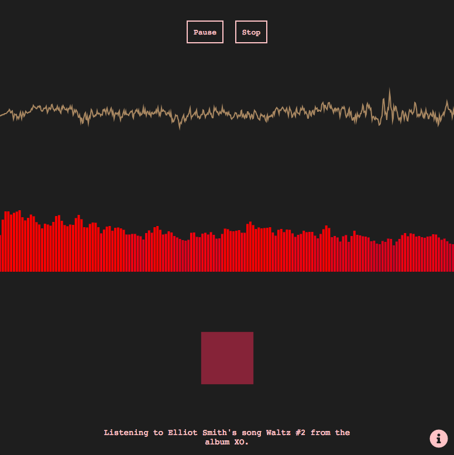

# Waltz

[Waltz](https://katshaze.github.io/waltz) is an experiment in using the Web Audio API and the HTML canvas element to visualise sound by getting frequency data of a given song through sound analysis.

**Note:** Currently works best in on desktop rather than mobile.

### How it works
The music is continually being measured for frequency and the data this frequency analysis gathers is used to render a waveform, a frequency bar graph and a pulsing square.

Elliot Smith's song Waltz #2 is preloaded into the app, and this can be played, paused and stopped using the controls.

